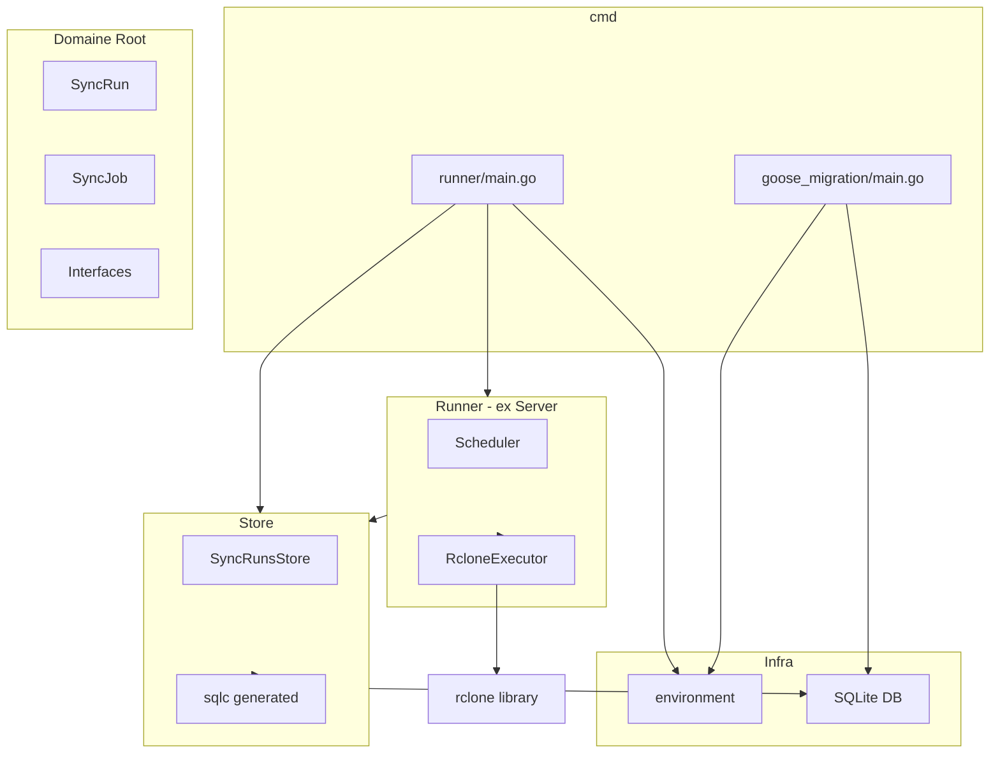

# Plan : Projet backup-guardian

## Contexte et objectifs

- **Objectif** : Redondance des données Google Drive vers des stockages S3 (paranoia légitime après usurpation d'identité)
- **Stack** : Go, rclone (sync), SQLite, slog, sqlc, goose, config .env
- **Architecture** : Reprendre la structure de [bookings-manager](bookings-manager) (domaine, store, "server") mais sans API — un runner/daemon qui lance des syncs
- **Référence** : [go-loungeup](bookings-manager/vendor/gitlab.com/loungeup/go-loungeup) pour les bonnes pratiques (options, erreurs, log)

## Architecture proposée



## Structure des dossiers

```
backup-guardian/
├── cmd/
│   ├── runner/
│   │   └── main.go
│   └── goose_migration/
│       └── main.go
├── domain/                    # Modèles et interfaces (équivalent root bookings-manager)
│   ├── sync_run.go
│   └── sync_job.go
├── store/
│   ├── store.go               # Store avec Options, WithDB, etc.
│   ├── sync_run.go            # Implémentation SyncRunsReadWriter
│   └── sqlc/                  # Code généré par sqlc (ou gen/dbstore)
├── runner/                    # Équivalent "server" mais sans API
│   ├── runner.go              # Runner principal avec Option pattern
│   ├── scheduler.go           # Planification des syncs (cron/sleep)
│   └── rclone.go              # Exécution rclone (interface RcloneExecutor)
├── migrations/
│   └── 00001_sync_runs.up.sql
├── sql/
│   ├── migrations/            # Schéma pour goose + sqlc
│   │   └── 00001_sync_runs.sql
│   └── queries/
│       └── sync_runs.sql
├── environment/
│   └── environment.go
├── internal/
│   └── errors/             # Copie adaptée de go-loungeup (MIT), MapSQLError pour SQLite
│       └── errors.go
├── sqlc.yaml
├── go.mod
├── .env.example
└── README.md
```

**Note** : Deux approches possibles pour migrations :

- **A** : `migrations/` avec format goose (`-- +goose Up` / `-- +goose Down`), sqlc pointe sur ce dossier comme schema
- **B** : `sql/migrations/` pour goose, sqlc lit le même dossier (comme [goose-sqlc](https://pressly.github.io/goose/blog/2024/goose-sqlc/))

On recommande **A** pour rester proche de bookings-manager, ou **B** si tu veux coller à l’exemple goose-sqlc.

## Détails par composant

### 1. Domaine (domain/)

- **sync_run.go** : Modèle `SyncRun` (id, job_name, started_at, finished_at, status, error_message, files_transferred, bytes_transferred, etc.) + interfaces `SyncRunsReader`, `SyncRunsWriter`, `SyncRunsReadWriter`. Validation avec `internal/errors` (CodeInvalid, etc.)
- **sync_job.go** : Modèle `SyncJob` (config rclone : source, destination, cron/schedule) — peut rester dans .env au début, ou en DB plus tard
- Pattern **options** et **validation** comme dans [order.go](bookings-manager/order.go)

### 2. Store (store/)

- **store.go** : `Store` avec `Option` pattern (`WithDB`, `WithSQLite`), composition des sous-stores (`SyncRuns SyncRunsReadWriter`)
- **sync_run.go** : Implémentation `syncRunsStore` qui appelle le code généré sqlc et utilise `internal/errors.MapSQLError` pour wrapper les erreurs SQL
- **Interface** : Injection du store dans le runner pour la testabilité (mocks)
- Pas de cache (comme go-loungeup) pour l’instant, SQLite suffit

### 3. Runner (runner/)

- **runner.go** : `Runner` avec `Option` pattern (`WithStore`, `WithRcloneExecutor`, `WithScheduler`, `WithLogger`)
- **scheduler.go** : Boucle ou cron qui déclenche les syncs à intervalle (ex. toutes les 6h)
- **rclone.go** : Interface `RcloneExecutor` + implémentation `LibraryRcloneExecutor` utilisant la librairie Go rclone (`fs.NewFs`, `sync.Sync`). Pas de CLI externe — tout est embarqué.

```go
type RcloneExecutor interface {
    Sync(ctx context.Context, source, dest string) (*RcloneResult, error)
}
```

### 4. Migrations et sqlc

- **Format goose** : `-- +goose Up` / `-- +goose Down` dans chaque migration
- **Table initiale** : `sync_runs` avec colonnes : id, job_name, status (pending|running|success|failed), started_at, finished_at, error_message, files_transferred, bytes_transferred, created_at
- **sqlc.yaml** :
  - `schema: migrations/` (ou `sql/migrations/`)
  - `queries: sql/queries/`
  - `engine: sqlite`
  - `gen.go.out: store/sqlc` ou `gen/dbstore`
- **Queries sqlc** : `CreateSyncRun`, `UpdateSyncRun`, `GetSyncRun`, `ListSyncRuns` (avec limit/offset si besoin)

### 5. Environment (environment/)

- **environment.go** : Struct `Variables` avec `caarlos0/env` + `godotenv.Load()`, comme [environment.go](bookings-manager/environment/environment.go)
- Variables suggérées : `BG_DB_PATH` (chemin SQLite), `BG_SYNC_SOURCE` (ex. `gdrive:`), `BG_SYNC_DEST` (ex. `s3:bucket/path`), `BG_SYNC_INTERVAL` (ex. `6h`), `BG_LOG_LEVEL` (debug|info|warn|error)

### 6. Logging (slog)

- Utiliser `log/slog` directement (pas go-loungeup) pour garder le projet autonome
- Handler JSON pour production, ou TextHandler pour dev selon `BG_LOG_LEVEL`
- Logger injecté dans le Runner et le Store via interface optionnelle pour les tests

### 7. cmd/goose_migration/main.go

Binaire dédié aux migrations, exécuté une fois avant le runner (ou dans le pipeline de déploiement).

1. `environment.Parse()` — lit `BG_DB_PATH`
2. Ouvrir SQLite (même driver que le runner)
3. Utiliser [pressly/goose/v3](https://github.com/pressly/goose) en lib : `goose.SetBaseFS(embed.FS)` sur `//go:embed migrations/*.sql`, puis `goose.Up(db, "migrations")`
4. Log de succès / erreur, exit 0 ou 1

**Usage** : `go run ./cmd/goose_migration` ou `backup-guardian-goose-migration` après build.

### 8. cmd/runner/main.go

1. `environment.Parse()`
2. Ouvrir SQLite — **les migrations sont supposées déjà appliquées** (lancer `goose_migration` avant, ou manuellement)
3. `store.New(store.WithDB(db))`
4. `runner.New(runner.WithStore(store), runner.WithRcloneExecutor(...), ...)`
5. `runner.Run()` — boucle qui attend et exécute les syncs

### 9. Dépendances (go.mod)

- `github.com/rclone/rclone` — librairie Go pour sync (pas besoin du binaire rclone installé)
- `github.com/caarlos0/env/v11`
- `github.com/joho/godotenv`
- `github.com/google/uuid`
- `github.com/pressly/goose/v3`
- `modernc.org/sqlite` ou `github.com/mattn/go-sqlite3` (SQLite driver)
- `github.com/sqlc-dev/sqlc` (CLI, pas en require)
- `github.com/stretchr/testify` (tests)

**Pas de dépendance go-loungeup** (accès GitLab impossible). On recopie les patterns utiles directement dans le projet :

- **`internal/errors/`** : copie du package `errors` de go-loungeup (MIT, crédit LoungeUp + Ben Johnson dans le commentaire). Adapter `MapSQLError` pour SQLite (pas de `lib/pq`) — uniquement `sql.ErrNoRows` → `CodeNotFound`, reste → `CodeInternal`.
- **Log** : `log/slog` standard uniquement, pas de copie du wrapper go-loungeup. Setup minimal (JSONHandler, niveau selon env).

## Fichiers à créer (ordre suggéré)

| #   | Fichier                               | Description                                                |
| --- | ------------------------------------- | ---------------------------------------------------------- |
| 1   | `go.mod`                              | Module `github.com/<user>/backup-guardian` ou chemin local |
| 2   | `.env.example`                        | Template des variables                                     |
| 3   | `environment/environment.go`          | Parse .env                                                 |
| 4   | `internal/errors/errors.go`           | Copie adaptée go-loungeup (MIT), MapSQLError pour SQLite   |
| 5   | `sqlc.yaml`                           | Config sqlc                                                |
| 6   | `migrations/00001_sync_runs.up.sql`   | Table sync_runs (goose)                                    |
| 7   | `migrations/00001_sync_runs.down.sql` | Rollback                                                   |
| 8   | `sql/queries/sync_runs.sql`           | Queries sqlc                                               |
| 9   | Générer sqlc                          | `sqlc generate`                                            |
| 10  | `domain/sync_run.go`                  | Modèle + interfaces                                        |
| 11  | `store/store.go`                      | Store avec Options                                         |
| 12  | `store/sync_run.go`                   | Impl SyncRunsReadWriter                                    |
| 13  | `runner/rclone.go`                    | Interface + impl RcloneExecutor                            |
| 14  | `runner/scheduler.go`                 | Logique de planification                                   |
| 15  | `runner/runner.go`                    | Runner principal                                           |
| 16  | `cmd/goose_migration/main.go`         | Binaire migrations (goose Up)                              |
| 17  | `cmd/runner/main.go`                  | Point d'entrée runner                                      |

## Points à trancher plus tard

- **Migrations** : Gérées par le binaire dédié `cmd/goose_migration` — le runner suppose qu’elles sont déjà appliquées.
- **Migrations détaillées** : Pour l’instant une table `sync_runs` suffit ; on pourra ajouter `sync_jobs` si plusieurs jobs/configs.
- **Rclone config** : rclone doit être configuré en amont (`rclone config` → `~/.config/rclone/rclone.conf`). Le projet utilise la librairie Go rclone — pas besoin d'installer le binaire rclone. ; le projet se contente d’appeler `rclone sync source dest`.
- **Signal handling** : Arrêt propre (SIGINT/SIGTERM) pour ne pas couper un sync en cours.
